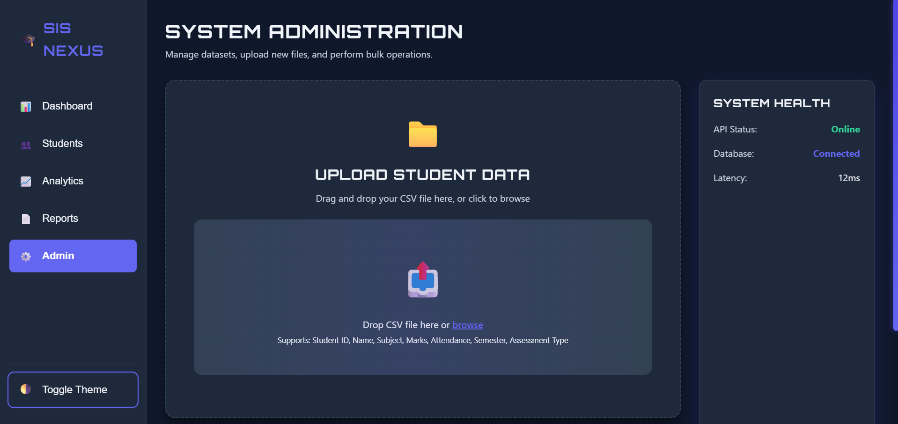
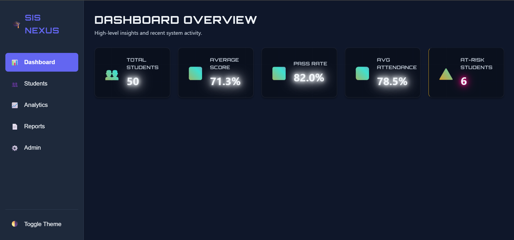
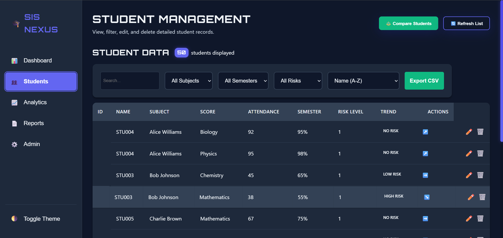
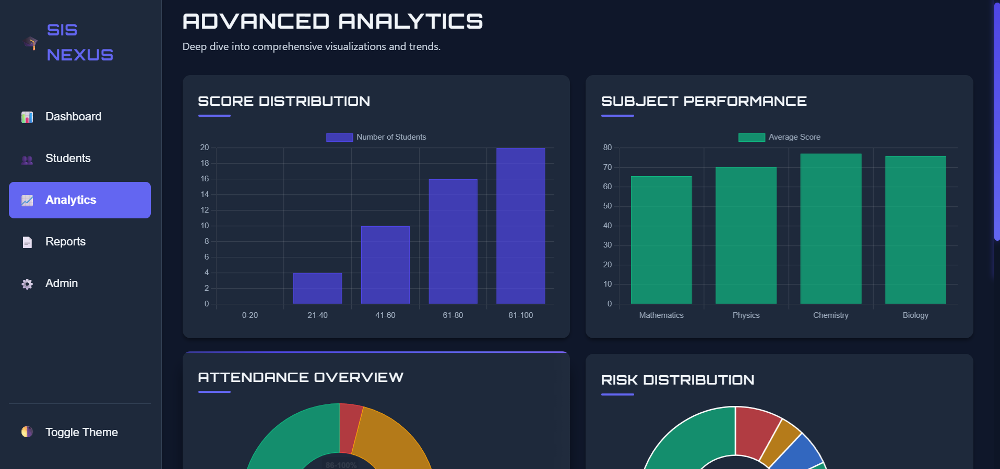
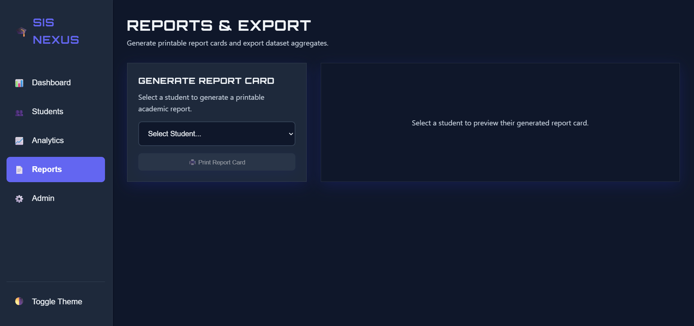

# 📊 Student Analytics Dashboard (SIS Nexus)

A **full-stack Student Information System (SIS)** designed for modern educational institutions.  
This platform transforms raw student data (**CSV**) into **actionable, real-time insights** with a **futuristic and highly interactive UI**.

---

# 🚀 Features

## 🧭 Multi-View Navigation
Easily switch between different modules:

- **Dashboard**
- **Students**
- **Analytics**
- **Reports**
- **Admin Panel**

---

## ✏️ Full CRUD Functionality
Manage student records directly from the interface:

- **View** student profiles
- **Filter** records
- **Edit** details
- **Delete** entries

---

## 📈 Advanced Analytics
Powerful insights to support decision making:

- ⏳ **Time-series performance tracking**
- 🔥 **Subject vs Semester heatmaps**
- ⚠️ **AI-based risk distribution insights**

---

## 📊 Interactive Visualizations
Dynamic charts built with **react-chartjs-2**:

- **Bar charts**
- **Doughnut charts**
- **Line graphs**

---

## 🧾 Report Generation
Generate professional **student report cards** instantly.

---

## ⚡ Global Command Palette
Press:

`Ctrl + K`

to instantly search for students from anywhere in the app.

---

## 📂 Smart CSV Uploads
Drag-and-drop CSV upload with built-in data validation:

- Detect missing fields
- Monitor data health
- Instant parsing

---

# 🛠️ Tech Stack

## Frontend
- **React.js**
- **Vite**
- **Chart.js**
- **HTML5**
- **Vanilla CSS** (Glassmorphism + Futuristic UI)

---

## Backend
- **Node.js**
- **Express.js**
- **Multer** (file uploads)
- **csv-parser**

---

## Storage
- **In-memory state management**
- Easily extendable to **MongoDB / PostgreSQL**

---

# 📸 Screenshots







---

# 📦 Installation & Setup

Make sure **Node.js** is installed on your system.

Download:
`https://nodejs.org/`

---

## 1️⃣ Clone the Repository

```bash```
```git clone https://github.com/Nikhita48Raj/student-analytics-dashboard.git```
```cd student-analytics-dashboard```


2️⃣ Start Backend Server

The backend processes CSV uploads and exposes REST APIs on port 5000.

cd backend
npm install
node server.js


3️⃣ Start Frontend Application

Run the React app using Vite (open a new terminal):

cd frontend
npm install
npm run dev


4️⃣ Open the App

Visit:

http://localhost:5173

Test upload using:

legacy/sample-data.csv


## 📁 Project Structure

- `/frontend`: The modern React application built using Vite.
- `/backend`: The Express server acting as the bridge for data mutations and CSV parsing.
- `/legacy`: Contains the original static vanilla JS iteration of the dashboard.

💡 Use Cases
Academic performance monitoring
Student risk detection
Institutional analytics dashboards
Education data visualization projects
